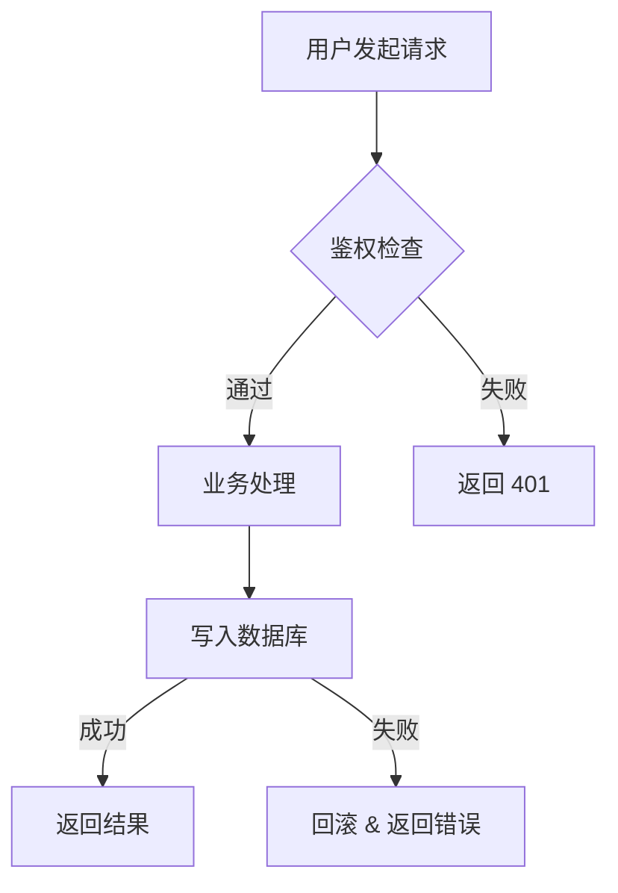

# 技术方案写作规范

`/spec` 生成的方案必须严格遵守以下结构。不要自由发挥章节，按模板填充。

---

## 方案模板

```markdown
# <方案标题>

## 背景与目标

### 问题/需求
<2-3 句话说清楚要解决什么问题，谁遇到了这个问题，影响是什么>

### 目标
<明确的、可验收的目标，用"完成后应该能 XXX"的句式>

### 非目标
<明确排除的范围，防止 scope creep>

---

## 现状分析

<当前代码/架构中与本次需求相关的部分，精确到文件/模块级别>
<如果是新增功能，说明现有的扩展点或类似模式>

---

## 方案设计

### 方案概述
<1-2 段话概括整体思路>

### 详细设计

#### 数据模型变更
<涉及数据库变更时，**必须**用 `mcp__postgres-db__query` 查询真实 schema 后再写方案。>

**查询流程**：
1. 查相关表的当前结构：`SELECT column_name, data_type, is_nullable, column_default FROM information_schema.columns WHERE table_name = '<table>'`
2. 查现有索引：`SELECT indexname, indexdef FROM pg_indexes WHERE tablename = '<table>'`
3. 查外键约束：`SELECT conname, pg_get_constraintdef(oid) FROM pg_constraint WHERE conrelid = '<table>'::regclass`
4. 如涉及大表，查行数量级：`SELECT reltuples::bigint FROM pg_class WHERE relname = '<table>'`

**输出要求**：
- 基于真实 schema 写出完整的 migration SQL（CREATE TABLE / ALTER TABLE / CREATE INDEX）
- 标注是否破坏性变更（DROP / NOT NULL / 改类型）
- 大表（>100 万行）的 DDL 必须标注锁表风险和建议执行方式（如 `CREATE INDEX CONCURRENTLY`）
- 给出回滚 SQL
- 无数据库变更则写"无数据模型变更"

#### API 变更
<新增/修改的接口，包含路径、方法、请求/响应结构。无则写"无 API 变更">

#### 核心流程图
<用 Mermaid 流程图描述核心改动的执行流程。必须包含：>
- 主要参与者（用户、前端、后端、数据库、第三方服务）
- 关键分支和判断节点
- 错误/异常路径
- 数据流向

示例格式：


> 简单改动（配置变更、文案修改等无流程可言的）可省略此节，写"无核心流程变更"。

#### 核心逻辑
<关键算法、状态流转、业务规则，用伪代码说明>

#### 文件变更清单
| 文件 | 操作 | 说明 |
|------|------|------|
| `path/to/file` | 新增/修改/删除 | 一句话说明 |

### 关键决策
<列出本方案中非显然的技术选型或设计决策，说明选了什么、为什么、放弃了什么>

---

## 风险与边界

### 已知风险
| 风险 | 影响 | 缓解措施 |
|------|------|----------|
| ... | ... | ... |

### 边界场景
<列出需要特别处理的边界情况>

### 兼容性
<对现有功能的影响，是否需要数据迁移，是否向后兼容>

---

## 验收标准

- [ ] <具体的、可测试的验收项 1>
- [ ] <具体的、可测试的验收项 2>
- [ ] ...

---

## 工作量估算

| 任务 | 预估 |
|------|------|
| ... | ... |
| **合计** | **X 人天** |
```

---

## 写作纪律

1. **每句话服务于本次需求**，不塞"最佳实践"科普
2. **文件路径要真实**，从代码库中 grep 确认后再写，不要猜
3. **数据模型写具体字段**，不要写"新增相关字段"
4. **API 写具体结构**，不要写"返回相关数据"
5. **不确定的写"待确认"**，不要用"可能"、"大概"糊弄
6. **多方案对比时**，每个方案都要写完整设计，不能方案 B 只写"类似方案 A 但是..."
7. **数据库变更必须基于实查**，禁止凭记忆猜 schema；MCP 查不通时标注"待确认：需人工查询 schema"
