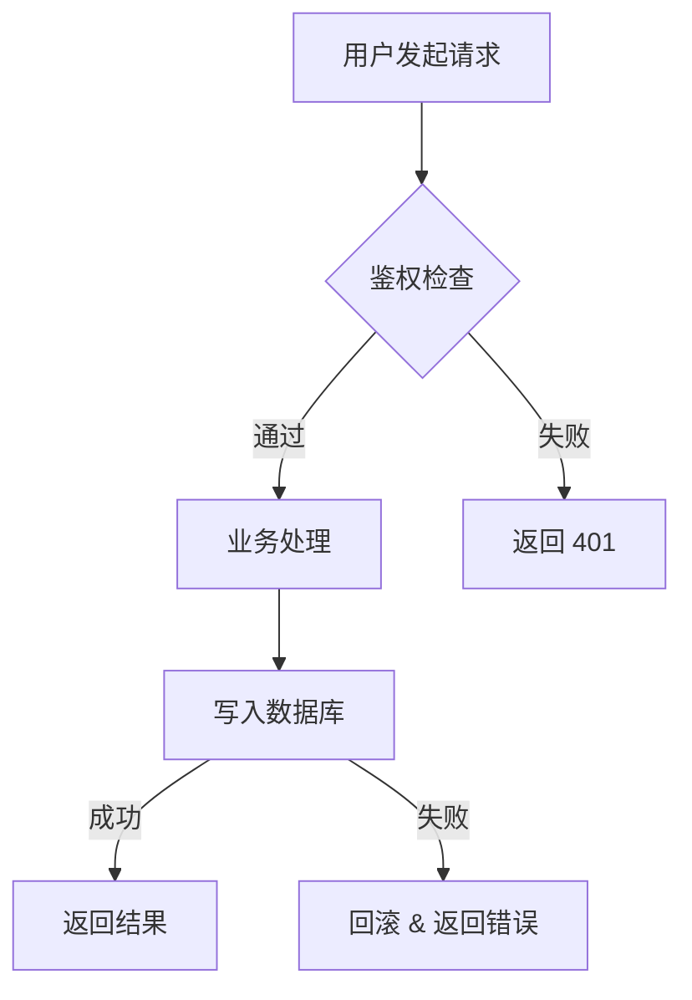

# 技术方案写作规范

`/spec` 生成的方案必须严格遵守以下结构。不要自由发挥章节，按模板填充。

---

## 方案模板

```markdown
# <方案标题>

## 背景与目标

### 问题/需求
<2-3 句话说清楚要解决什么问题，谁遇到了这个问题，影响是什么>

### 目标
<明确的、可验收的目标，用"完成后应该能 XXX"的句式>

### 非目标
<明确排除的范围，防止 scope creep>

---

## 现状分析

<当前代码/架构中与本次需求相关的部分，精确到文件/模块级别>
<如果是新增功能，说明现有的扩展点或类似模式>

---

## 方案设计

### 方案概述

目标读者是**评审人**（熟悉业务但不一定熟这块代码）。这一节要让人不看后面的详细设计就能判断"这个做法对不对"。

**按链路讲逻辑，不是按文件讲改动**：

- 沿着一次请求 / 一条数据流 / 一次触发完整走一遍，每到一处改动就说"原本怎样 → 改完怎样"
- 技术名词第一次出现给一句铺垫（如 "`resolve_channels` 是选上游渠道的主入口"），不要只扔名字
- 核心分支（三态判断、多路降级、容错）拿出来单独列表或加小标题对比

**长度与结构**：

- 通常 3–5 段；1–2 段的名字堆砌基本说明没讲清楚
- 改动点多时拆小标题（"第 1 步：..."、"缓存怎么办"、"容易踩的坑"）
- 必要时给一段当前流程的伪代码 + 改后对比，帮读者建立锚点

**反面示例**（不要这么写）：

> 1. `validate_api_key` SELECT 多加 `permissions`，`ApiKeyInfo` 新增字段 ...
> 2. 在 `proxy::handler` 调 `resolve_channels` 前 ...

这是给 AI 看的施工单，不是给人看的评审材料。

**正面示例**（节选）：

> 代理接到请求现在做三件事：① 查 token 得到 `ApiKeyInfo` ② 调 `resolve_channels` 按用户折扣档位过滤并按权重洗牌 ③ 选一个转发。本次要动 ① 和 ②。
>
> **第 ① 步：鉴权查库时顺手多取一列 `permissions`**，丢进 `ApiKeyInfo`。30s Redis 缓存照旧，旧缓存没这字段也能反序列化（`#[serde(default)]`）。
>
> **第 ② 步：调 `resolve_channels` 前先看当前 key 的 `permissions.channels[model]`**，分三种情况：没配 → 走老路；非空数组 → 在用户级过滤后再套白名单；空数组 → 明确拒绝，不查 DB。

### 详细设计

#### 数据模型变更
<涉及数据库变更时，**必须**用 `mcp__postgres-db__query` 查询真实 schema 后再写方案。>

**查询流程**：
1. 查相关表的当前结构：`SELECT column_name, data_type, is_nullable, column_default FROM information_schema.columns WHERE table_name = '<table>'`
2. 查现有索引：`SELECT indexname, indexdef FROM pg_indexes WHERE tablename = '<table>'`
3. 查外键约束：`SELECT conname, pg_get_constraintdef(oid) FROM pg_constraint WHERE conrelid = '<table>'::regclass`
4. 如涉及大表，查行数量级：`SELECT reltuples::bigint FROM pg_class WHERE relname = '<table>'`

**输出要求**：
- 基于真实 schema 写出完整的 migration SQL（CREATE TABLE / ALTER TABLE / CREATE INDEX）
- 标注是否破坏性变更（DROP / NOT NULL / 改类型）
- 大表（>100 万行）的 DDL 必须标注锁表风险和建议执行方式（如 `CREATE INDEX CONCURRENTLY`）
- 给出回滚 SQL
- 无数据库变更则写"无数据模型变更"

#### API 变更
<新增/修改的接口，包含路径、方法、请求/响应结构。无则写"无 API 变更">

#### 核心流程图
<用 Mermaid 流程图描述核心改动的执行流程。必须包含：>
- 主要参与者（用户、前端、后端、数据库、第三方服务）
- 关键分支和判断节点
- 错误/异常路径
- 数据流向

示例格式：


> 简单改动（配置变更、文案修改等无流程可言的）可省略此节，写"无核心流程变更"。

#### 核心逻辑
<关键算法、状态流转、业务规则，用伪代码说明>

#### 文件变更清单
| 文件 | 操作 | 说明 |
|------|------|------|
| `path/to/file` | 新增/修改/删除 | 一句话说明 |

### 关键决策

**只列需要外部拍板或事后可能被质疑的决策**，不列实现细节。

**收录标准**（满足任一即可）：

1. 需要 PM / 架构师确认的语义理解、产品取舍、优先级
2. 事后可能被问"为什么不走另一条路"（存在明显替代方案，且替代方案不显然错）
3. 有明显 trade-off（为了 A 牺牲 B）

**不要收录**：

- 实现层命名、类型选择、常量取值（`i32` vs `i64`、变量名、枚举命名）
- 行业通识（为什么用 `Option`、为什么加 `#[serde(default)]`、为什么用 `Arc`）
- 方案其他章节已经解释过的选择

**格式：每条以"问题"开头，不要以"答案"开头**，让评审第一眼看到要拍板的是什么：

- ❌ "我们选择 `api_key_id` 作为缓存 key 后缀"
- ✅ "缓存 key 里带 `api_key_id` 还是 key hash？"

**数量**：3–5 条为宜。超过 5 条多半掺进了实现细节；少于 2 条要么方案确实简单（复核 Size 是否虚高），要么漏了该暴露的取舍。

**每条结构**：

```
**决策 N：<问题>**

答：<选了什么>。

理由：<为什么，最好带对立方案及其弱点>。

<如需外部确认，显式写"需 PM / 架构师在上线前确认 XX 语义"；否则省略这行>
```

---

## 风险与边界

### 已知风险
| 风险 | 影响 | 缓解措施 |
|------|------|----------|
| ... | ... | ... |

### 边界场景
<列出需要特别处理的边界情况>

### 兼容性
<对现有功能的影响，是否需要数据迁移，是否向后兼容>

---

## 验收标准

分两部分：**业务场景验收** + **工程质量基线**。**不要**按"行为/测试/工具链/可观测性/文档"的五层分类——那会把验收写成 checklist，丢了场景感。

### 业务场景验收

用"给定 → 操作 → 期望"三段式写。目标：**PM / QA 照单子能人工或自动化回归**，读者不用读代码就能判断过/不过。

**覆盖面**（按 Size 自适应，至少覆盖前 3 类）：

1. **核心功能路径**（happy path）
2. **边界**（空值 / 空数组 / 缺失字段 / 禁用语义）
3. **兼容 / 降级**（没用新功能时行为不变）
4. **异常 / 脏数据**（外部输入不合预期时的容错）
5. **副作用**（缓存、日志、清理） —— 涉及才写

**每个场景的格式**：

```
### 场景 N：<一行中文标题，说明验的是什么>

- **给定**：<前置状态：DB / 配置 / 缓存里有什么>
- **操作**：<触发动作，越具体越好>
- **期望**：<可观测的结果：响应码 + 响应体要点 + 日志关键字段 + DB 变化>
```

**禁止写法**：

- ❌ 用英文 snake_case 测试函数名做场景名（`key_level_whitelist_filters_channels`）—— 验收标准不是测试代码
- ❌ "新增逻辑必须有单元/集成测试，覆盖核心分支 + 至少 1 个错误路径" —— 这是测试策略，不是验收
- ❌ "关键路径有 `tracing` 日志" —— 挪到工程质量基线
- ❌ 只写一条模糊的"功能正常"，不给具体场景

### 工程质量基线

默认要求，一段清单就够，不要在每个场景里重复：

- `cargo fmt --check` / `cargo clippy --all-targets -- -D warnings` / `cargo test` 全绿
- 新增公开 API 有 `///` 文档注释
- 关键路径有 `tracing` 日志（含 `request_id` 或核心上下文字段）
- 新增 `unsafe` 块（若有）在 Safety 注释里写明 invariant
- 新增 / 修改的 HTTP 接口按项目约定更新文档（OpenAPI / README / 等）

---

## 工作量估算

| 任务 | 预估 |
|------|------|
| ... | ... |
| **合计** | **X 人天** |
```

---

## 写作纪律

1. **每句话服务于本次需求**，不塞"最佳实践"科普
2. **文件路径要真实**，从代码库中 grep 确认后再写，不要猜
3. **数据模型写具体字段**，不要写"新增相关字段"
4. **API 写具体结构**，不要写"返回相关数据"
5. **不确定的写"待确认"**，不要用"可能"、"大概"糊弄
6. **多方案对比时**，每个方案都要写完整设计，不能方案 B 只写"类似方案 A 但是..."
7. **数据库变更必须基于实查**，禁止凭记忆猜 schema；MCP 查不通时标注"待确认：需人工查询 schema"
