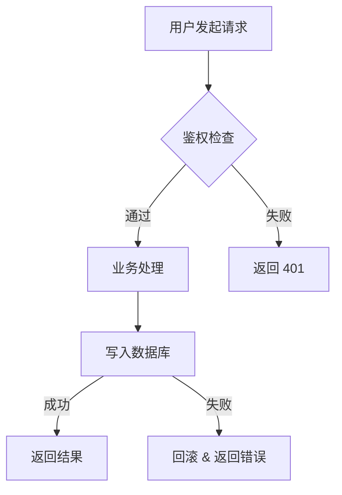

# 技术方案写作规范

`/spec` 生成的方案必须严格遵守以下结构。不要自由发挥章节，按模板填充。

---

## 方案模板

```markdown
# <方案标题>

## 背景与目标

### 问题/需求
<2-3 句话说清楚要解决什么问题，谁遇到了这个问题，影响是什么>

### 目标
<明确的、可验收的目标，用"完成后应该能 XXX"的句式>

### 非目标
<明确排除的范围，防止 scope creep>

---

## 现状分析

<当前代码/架构中与本次需求相关的部分，精确到文件/模块级别>
<如果是新增功能，说明现有的扩展点或类似模式>

---

## 方案设计

### 方案概述

目标读者是**评审人**（熟悉业务但不一定熟这块代码）。这一节要让人不看后面的详细设计就能判断"这个做法对不对"。

#### 硬性结构（不按此结构就不合格，必须重写）

1. **第一段必须是"改动前的请求/数据流"完整描述**。写一段当前一次请求从进入到产出的完整流程（可以是伪步骤），并在末尾标明"本次要动的是第 X 步和第 Y 步"。不允许跳过这段直接列改动。
2. **按请求流程顺序描述改动**。每到一处改动就说"原本怎样 → 改完怎样"，技术名词第一次出现给一句铺垫（如 "`resolve_channels` 是选上游渠道的主入口"）。
3. **核心分支（三态判断 / 多路降级 / 容错）必须用表格或小标题对比**。不允许混进一整段长文里。
4. **容易踩的坑单独一段**（如有）。

#### 硬性禁止（出现任一即不合格）

- ❌ 以 "1. X 扩字段"、"2. Y 签名加参"、"3. Z 扩展 SCAN" 这种文件/符号清单开头
- ❌ 第一段直接列改动点，没有请求流程铺垫
- ❌ 用类型签名 / SQL 片段代替人话（例："反序列化为 `Option<{ channels: Option<HashMap<String, Vec<Decimal>>> }>`"）
- ❌ 1–2 段就完事（字数不够说明没讲清楚）

#### 反面示例（AI 默认会这样写，见到就重写）

> 三步改动:
> 1. `ApiKeyInfo` 扩字段 `permissions`;`validate_api_key` 的 SQL 追加 `ak.permissions`。
> 2. `ChannelRouter::resolve_channels` 新增入参 `api_key_id + key_channel_whitelist`。
> 3. `clear_user_channel_cache` 扩展 SCAN。

这是施工单，不是评审材料。读者还没建立"请求是怎么流的"就被塞文件名，看完等于没看。

#### 完整正面示例（必须按这个结构写，不是节选）

> 代理接到一个请求，当前流程是：
>
> ```
> 1. 拿 token 查数据库 → 得到 ApiKeyInfo
> 2. 调 resolve_channels(user_id, model) → 得到该用户能用的渠道列表
>    （内部：按 user_discount_tier 白名单过滤 → 按权重洗牌 → 缓存 5 分钟）
> 3. 选一个渠道转发
> ```
>
> 本次要动的是第 1 步和第 2 步。
>
> **第 1 步：鉴权查库时顺手多取一列 `permissions`**。`validate_api_key` 本来就有 SELECT，多一列而已；`ApiKeyInfo` 加一个可选字段。30 秒 Redis 缓存继续用，旧缓存里没这个字段也不会炸。
>
> **第 2 步：调 `resolve_channels` 前先看一眼当前 key 的 `permissions.channels[model]`**，分三种情况：
>
> | 配置 | 做什么 |
> |---|---|
> | null 或没当前 model | 当没看见，走老流程 |
> | 非空数组 `[0.6]` | 在用户级过滤之后，再留下 `discount_rate ∈ 数组` 的那些渠道 |
> | 空数组 `[]` | 这把 key 禁用该模型，直接返回"无可用渠道"，不查数据库 |
>
> **两个容易踩的坑**：
>
> - **脏数据**：Dashboard 可能写进非法 `permissions`。代理不甩 500，warn 日志 + 当作没配走老流程。
> - **model 降级**：handler 会先用具体 model 调 `resolve_channels`，失败再用 category 调。白名单判断要对两次**分别**跑——不能把第一次的 filter 带到第二次。

### 详细设计

#### 数据模型变更
<涉及数据库变更时，**必须**用 `mcp__postgres-db__query` 查询真实 schema 后再写方案。>

**查询流程**：
1. 查相关表的当前结构：`SELECT column_name, data_type, is_nullable, column_default FROM information_schema.columns WHERE table_name = '<table>'`
2. 查现有索引：`SELECT indexname, indexdef FROM pg_indexes WHERE tablename = '<table>'`
3. 查外键约束：`SELECT conname, pg_get_constraintdef(oid) FROM pg_constraint WHERE conrelid = '<table>'::regclass`
4. 如涉及大表，查行数量级：`SELECT reltuples::bigint FROM pg_class WHERE relname = '<table>'`

**输出要求**：
- 基于真实 schema 写出完整的 migration SQL（CREATE TABLE / ALTER TABLE / CREATE INDEX）
- 标注是否破坏性变更（DROP / NOT NULL / 改类型）
- 大表（>100 万行）的 DDL 必须标注锁表风险和建议执行方式（如 `CREATE INDEX CONCURRENTLY`）
- 给出回滚 SQL
- 无数据库变更则写"无数据模型变更"

#### API 变更
<新增/修改的接口，包含路径、方法、请求/响应结构。无则写"无 API 变更">

#### 核心流程图
<用 Mermaid 流程图描述核心改动的执行流程。必须包含：>
- 主要参与者（用户、前端、后端、数据库、第三方服务）
- 关键分支和判断节点
- 错误/异常路径
- 数据流向

示例格式：


> 简单改动（配置变更、文案修改等无流程可言的）可省略此节，写"无核心流程变更"。

#### 核心逻辑
<关键算法、状态流转、业务规则，用伪代码说明>

#### 文件变更清单
| 文件 | 操作 | 说明 |
|------|------|------|
| `path/to/file` | 新增/修改/删除 | 一句话说明 |

### 关键决策

**只列需要外部拍板或事后可能被质疑的决策**，不列实现细节。

#### 收录标准（满足任一即可）

1. 需要 PM / 架构师确认的语义理解、产品取舍、优先级
2. 事后可能被问"为什么不走另一条路"（存在明显替代方案，且替代方案不显然错）
3. 有明显 trade-off（为了 A 牺牲 B）

#### 不要收录

- 实现层命名、类型选择、常量取值（`i32` vs `i64`、变量名、枚举命名）
- 行业通识（为什么用 `Option`、为什么加 `#[serde(default)]`、为什么用 `Arc`）
- 方案其他章节已经解释过的选择
- "我们决定这样做" 但没有替代方案的 —— 那是做法，不是决策
- 纯实现位置选择（空数组短路放 handler 还是 router、过滤用 SQL 还是 Rust `retain`）

#### 硬性格式规则（不符合就删掉或重写）

1. **每条决策的标题必须以问号结尾**。标题不是问句就不是决策。
   - ❌ "决策 1：密钥级缓存独立,按 `api_key_id` 维度"
   - ✅ "决策 1：密钥级缓存按 `api_key_id` 分维度，还是每次请求查 DB？"
2. **数量 3–5 条**。超过 5 条必然掺进实现细节，挑重要的 3–5 条保留，其余删除；少于 2 条 → 复核 Size 是否虚高，或检查是否漏了该暴露的取舍。
3. **如需外部确认**，独立一行写 `**需 PM / 架构师在上线前确认：<具体问题>**`，放在"理由"之后。不要藏在括号里或末尾小字。
4. **不设置单独的"待确认"章节**。所有待确认事项都直接放在对应决策的"需 ... 确认"行。

#### 每条决策的结构

```
**决策 N：<问题，以问号结尾>**

答：<选了什么>。

理由：<为什么，必须带对立方案及其弱点>。

**需 PM / 架构师在上线前确认：<具体问题>**    ← 只有需要外部确认时才写这行
```

#### 完整正面示例（必须按这个形式写，2 条为示例）

> **决策 1：密钥级白名单相对用户级白名单，是"收窄"还是"覆盖"？**
>
> 答：按"收窄"实现（SQL 里用 AND），即"只能在用户级允许的渠道里再挑一部分"。
>
> 理由：用户级白名单是账户授权边界。若按"覆盖"语义，给 key 配 `[0.1]` 就能用 0.1 折渠道，等于 key 级配置越权用户级授权。白名单语义下"优先级更高"和"收窄"不冲突。
>
> **需 PM 在上线前确认**：需求原文"密钥级优先级最高"的实际期望是"收窄"还是"完全覆盖"。若是后者，SQL 和测试都要翻一遍。
>
> **决策 2：配置改动后生效延迟 30 秒可接受吗？**
>
> 答：本期接受，不加即时刷新接口。
>
> 理由：30 秒来自 `ApiKeyInfo` 的 Redis 缓存 TTL。加一个"按 api_key_id 清缓存"的即时接口不难，但要多一套路由和 Dashboard 联动。判断 30s 够用，本期先上。
>
> **需 PM 确认**：如果业务明确要求改完即时生效，此项翻转，加上实时清缓存接口。

---

## 风险与边界

### 已知风险
| 风险 | 影响 | 缓解措施 |
|------|------|----------|
| ... | ... | ... |

### 边界场景
<列出需要特别处理的边界情况>

### 兼容性
<对现有功能的影响，是否需要数据迁移，是否向后兼容>

---

## 验收标准

分两部分：**业务场景验收** + **工程质量基线**。

#### 硬性禁止（出现任一即不合格，必须重写）

- ❌ 使用 `- [ ]` checkbox 语法写验收项
- ❌ 使用 "行为级"、"测试级"、"工具链级"、"可观测性级"、"文档级" 作为小节标题或条目前缀（如 "**行为级-密钥有配置**"）
- ❌ 用英文 snake_case 测试函数名作场景名（`key_level_whitelist_filters_channels`）
- ❌ 写 "新增逻辑必须有单元/集成测试，覆盖核心分支 + 至少 1 个错误路径" —— 这是测试策略不是验收
- ❌ 把 "关键路径有 tracing 日志"、"公开 API 有 `///` 注释" 当作一条验收 —— 这些进"工程质量基线"段，不拆到业务场景里
- ❌ 只写"功能正常"、"覆盖全部场景"这种模糊条目

### 业务场景验收

每个场景用独立的 `###` 三级小标题，标题是**中文短句，说明验的是什么**。每个场景下用"给定 / 操作 / 期望"三段式。

#### 覆盖面（按 Size 自适应，至少覆盖前 3 类）

1. **核心功能路径**（happy path）—— 至少 1 条
2. **边界**（空值 / 空数组 / 缺失字段 / 禁用语义）—— 至少 1 条
3. **兼容 / 降级**（没用新功能时行为不变）—— 至少 1 条
4. **异常 / 脏数据**（外部输入不合预期时的容错）
5. **副作用**（缓存、日志、清理） —— 涉及才写

#### 每个场景的固定结构

```
### 场景 N：<一行中文短句，描述验什么>

- **给定**：<前置状态：DB 里有什么、缓存里有什么、配置长啥样>
- **操作**：<触发动作，具体到接口 / 参数 / 调用次数>
- **期望**：<可观测结果：响应码 + 响应体要点 + 日志关键字段 + DB 状态变化>
```

#### 完整正面示例（AI 产出必须长这样，不是 checkbox）

> ### 场景 1：密钥有白名单时只命中白名单内的渠道
>
> - **给定**：user A 的 `user_discount_tier` 允许 claude_code 走 {0.1, 0.6} 两档；A 的 key K1 配 `permissions = {"channels":{"claude_code":[0.6]}}`
> - **操作**：用 K1 发 10 次 claude_code 请求
> - **期望**：10 次全部转发到 `discount_rate = 0.6` 的渠道；`tracing` 日志 `allowed_discounts` 字段为 `[0.6]`
>
> ### 场景 2：密钥无配置时行为与上线前一致
>
> - **给定**：同 user 下另一把 key K2，`permissions = null`
> - **操作**：用 K2 发 10 次请求
> - **期望**：候选渠道分布与 main 分支一致；Redis 缓存 key 前缀为 `proxy:user_channels:v5:u:...`，不含 `api_key_id`
>
> ### 场景 3：空数组禁用模型
>
> - **给定**：key K3 配 `{"channels":{"claude_code":[]}}`
> - **操作**：用 K3 请求 claude_code
> - **期望**：返回 503，响应体注明"该 key 禁止访问 claude_code"；无 DB 渠道查询（pg 慢日志或 tracing span 验证）；`request_log` 写一条 `error_type = no_channels`

### 工程质量基线

默认要求一段清单，不要拆到每个场景里重复：

- `cargo fmt --check` / `cargo clippy --all-targets -- -D warnings` / `cargo test` 全绿
- 新增公开 API 有 `///` 文档注释
- 关键路径有 `tracing` 日志（含 `request_id` 或核心上下文字段）
- 新增 `unsafe` 块（若有）在 Safety 注释里写明 invariant
- 新增 / 修改的 HTTP 接口按项目约定更新文档（OpenAPI / README / 等）

---

## 工作量估算

| 任务 | 预估 |
|------|------|
| ... | ... |
| **合计** | **X 人天** |
```

---

## 写作纪律

1. **每句话服务于本次需求**，不塞"最佳实践"科普
2. **文件路径要真实**，从代码库中 grep 确认后再写，不要猜
3. **数据模型写具体字段**，不要写"新增相关字段"
4. **API 写具体结构**，不要写"返回相关数据"
5. **不确定的写"待确认"**，不要用"可能"、"大概"糊弄
6. **多方案对比时**，每个方案都要写完整设计，不能方案 B 只写"类似方案 A 但是..."
7. **数据库变更必须基于实查**，禁止凭记忆猜 schema；MCP 查不通时标注"待确认：需人工查询 schema"
